# flutter_study_app

A new Flutter application.

## 入门与进阶
* [Google/flutter](https://github.com/flutter/flutter)
* [flutter中文官网](https://flutter.cn/)
* [alibaba/flutter-go](https://github.com/alibaba/flutter-go)

## 样式效果演示
|主页|drawer|关于|
|:---:|:---:|:---:|
|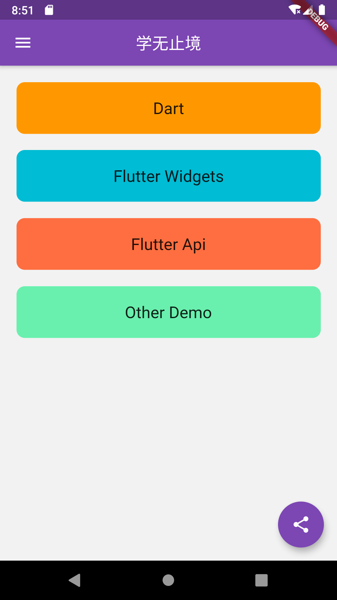|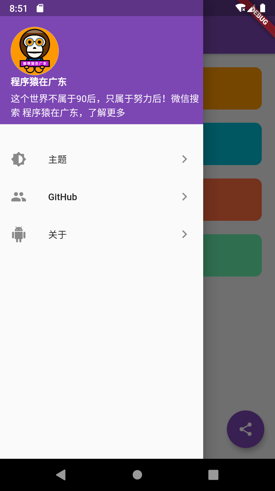||

|其他Demo|修改主题色|解压缩插件|
|:---:|:---:|:---:|
|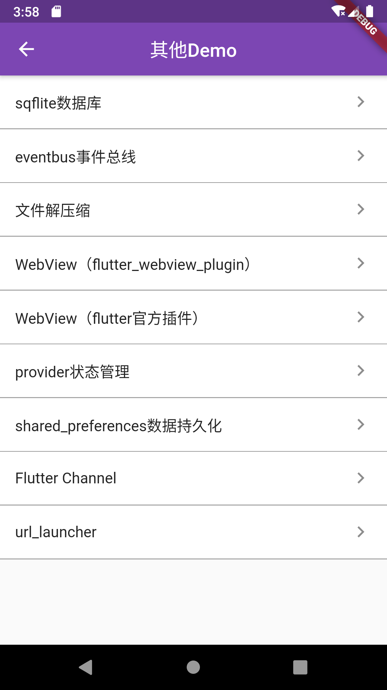|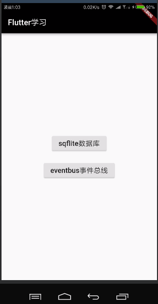|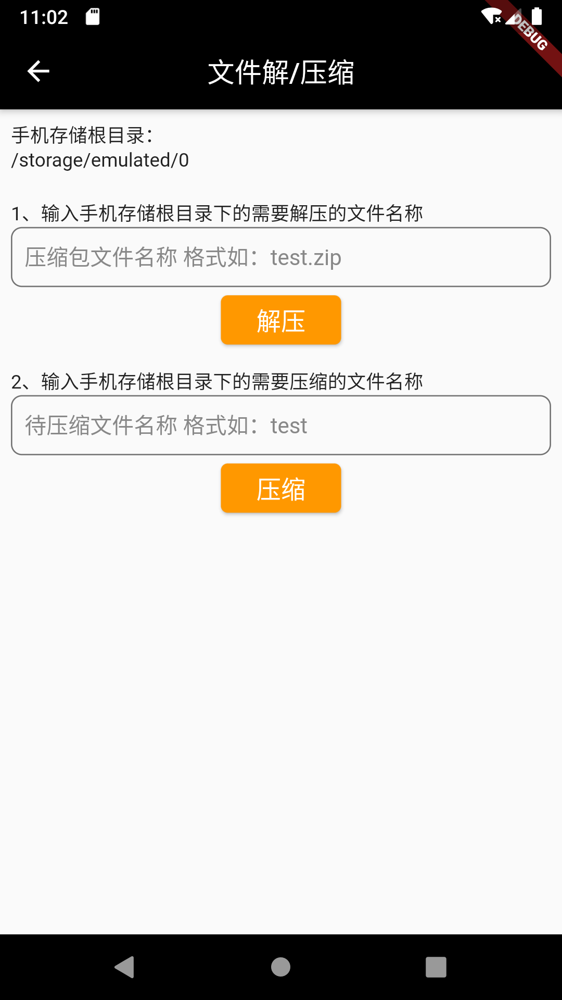|

|flutterWebviewPlugin|fluro路由|shared_preferences|
|:---:|:---:|:---:|
|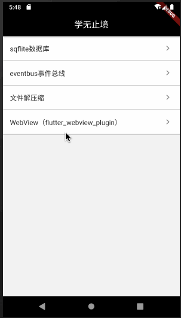|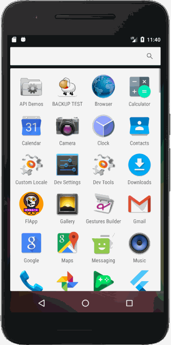|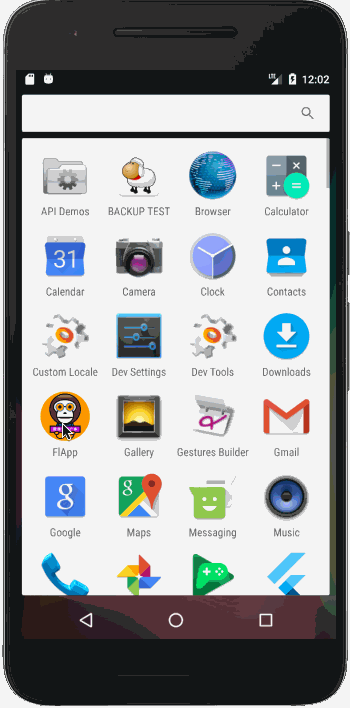|

|sqflite数据库|flutter channel|flutter url_launcher|
|:---:|:---:|:---:|
|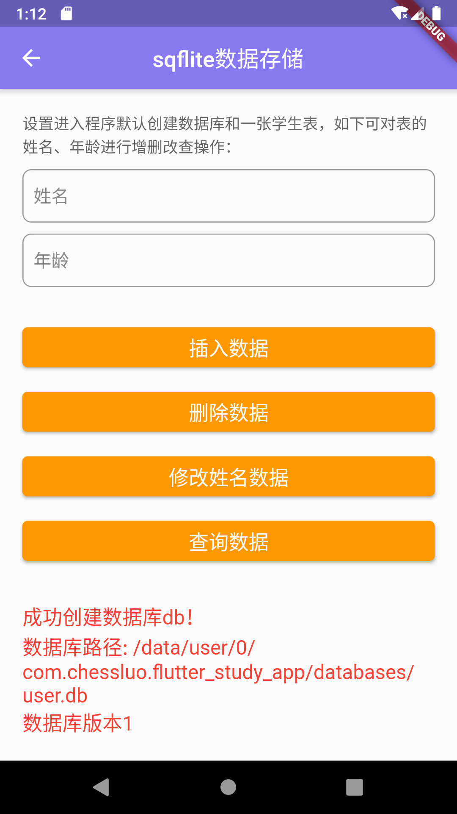||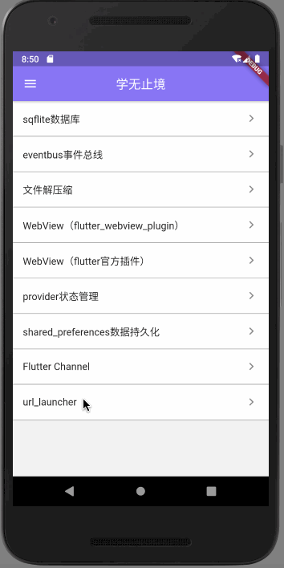|

|全局变灰|||
|:---:|:---:|:---:|
|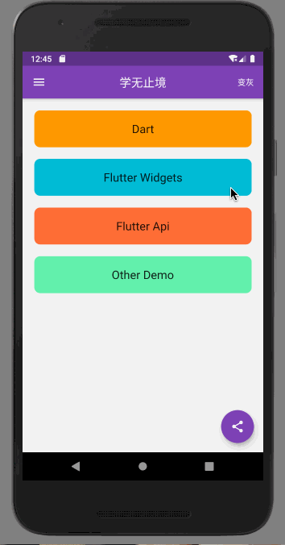|||

|Dart|
|:---:|
|功能demo开发中~|

|Widgets|
|:---:|
|功能demo开发中~|

|Api|
|:---:|
|功能demo开发中~|

## 更多
* 更多开源库请关注：[GitHub](https://github.com/ChessLuo)
* 最近建了公众号，欢迎大家关注，一起学习Android、小程序、跨平台开发~
* 