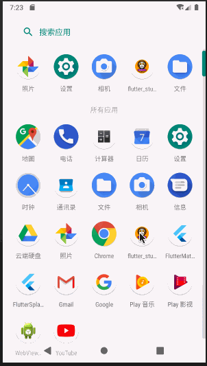
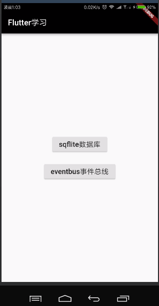
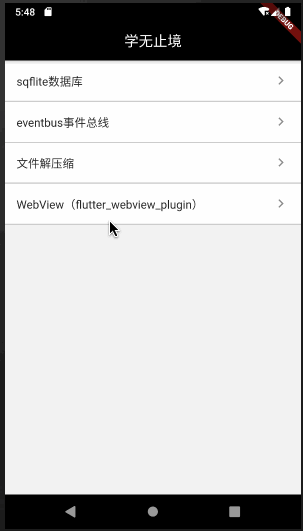
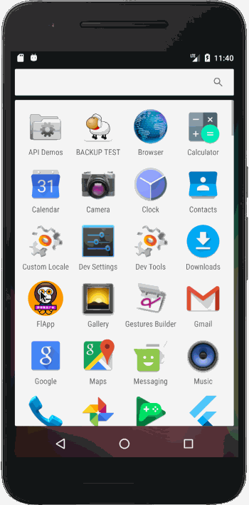
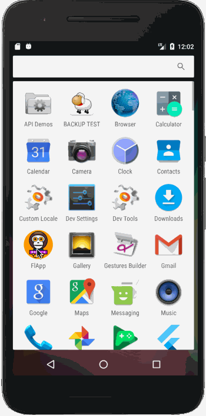
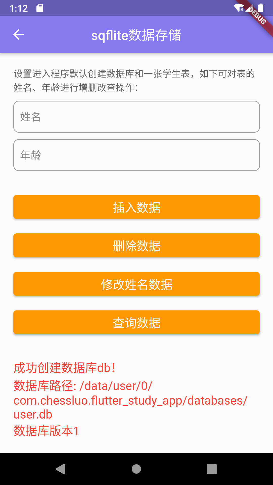
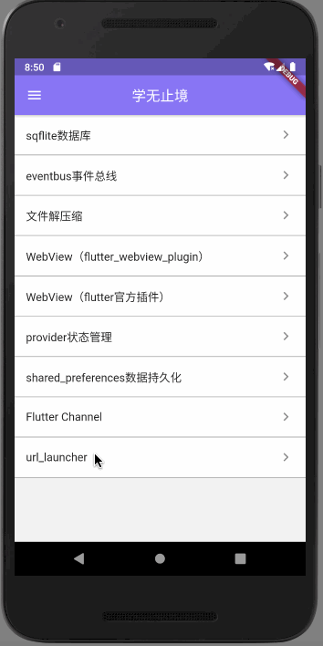

# flutter_study_app

A new Flutter application.

## 入门与进阶
* [Google/flutter](https://github.com/flutter/flutter)
* [flutter中文官网](https://flutter.cn/)
* [alibaba/flutter-go](https://github.com/alibaba/flutter-go)

## Getting Started

This project is a starting point for a Flutter application.

A few resources to get you started if this is your first Flutter project:

- [Lab: Write your first Flutter app](https://flutter.io/docs/get-started/codelab)
- [Cookbook: Useful Flutter samples](https://flutter.io/docs/cookbook)

For help getting started with Flutter, view our 
[online documentation](https://flutter.io/docs), which offers tutorials, 
samples, guidance on mobile development, and a full API reference.

#### 样式效果演示
|主页|修改主题色|解压缩插件|
|:---:|:---:|:---:|
||||

|flutterWebviewPlugin|fluro路由|shared_preferences|
|:---:|:---:|:---:|
||||

|sqflite数据库|flutter channel|flutter url_launcher|
|:---:|:---:|:---:|
||||

